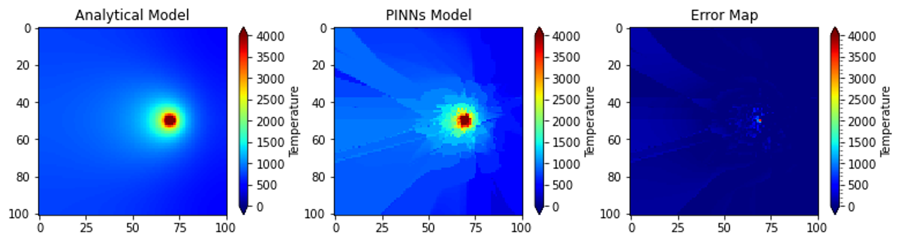
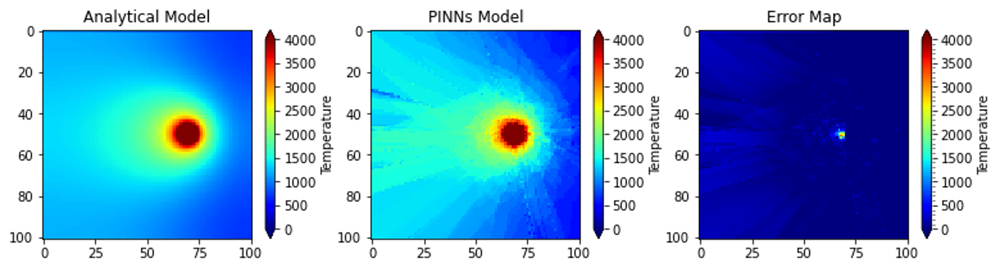

# Physics-Informed Neural Networks Framework for Predicting Microstructures in Metal Additive Manufacturing

## Abstract

Metal Additive Manufacturing (AM) offers the potential to produce complex parts, necessitating a deep understanding of process-structure-property relationships. Traditional models often face challenges like high computational costs and lack of interpretability. This project introduces a Physics-Informed Neural Network (PINN) framework to predict microstructures for additively manufactured SS316L components via the Direct Energy Deposition (DED) process. By embedding first principles of physics into the neural network's loss function, the framework enables informed learning of microstructures based on thermal fields. This work was presented at the MMLDT 2021 conference.

## Project Overview

### Thermal Dynamics Modeling

The thermal dynamics during the AM process were modeled using the "Double Ellipsoid Heat Source Model." The MOOSE open-source framework by Idaho National Lab was used to simulate the heat source over a 10mm x 10mm x 2mm domain.

### Loss Function

The loss function integrates data-driven and physics-driven components:

- **Data Loss**: 
$$ L_{\text{data}}(W, b) = \text{MSE}(\text{Analytical Model}, \text{PINNs prediction}) $$

- **PDE Loss**: 
$$ \lambda_{\text{pde}}L_{\text{PDE}}(W, b) = \log(1 + \text{residual}^2) $$

- **Regularization**: 
$$ \lambda_W L_1 |W| $$

### Training Details

- **Training Points**: 101 x 21 across 110 timesteps = 233,310 data points.
- **Optimizers**:
  - **Adam Optimizer**: Learning Rate = 0.7, Beta_1 = 0.1, Beta_2 = 0.9
  - **LBFGS Optimizer**: Maxiter = 30,000

## Results

The model predictions for different laser power settings are shown below. The visualizations compare the PINN predictions with analytical solutions for temperature fields during the additive manufacturing process.

<div style="background-color: white; padding: 10px; text-align: center;">
  <h3 style="color: black;">300W Laser Power</h3>
  
</div>

<div style="background-color: white; padding: 10px; text-align: center; margin-top: 20px;">
  <h3 style="color: black;">600W Laser Power</h3>
  
</div>

These results demonstrate the model's ability to capture thermal dynamics under different process parameters. The left plots show the analytical solutions while the right plots display the neural network predictions.

## Getting Started

### Prerequisites

- Python 3.x
- TensorFlow
- MOOSE Framework
- Additional Python libraries as listed in `requirements.txt`

### Installation

1. Clone the repository:
   ```bash
   git clone <repository-url>
   cd <repository-directory>
   ```

2. Install the required packages:
   ```bash
   pip install -r requirements.txt
   ```

### Running the Model

1. Prepare the dataset and configure the parameters in `main.py`.
2. Execute the training script:
   ```bash
   python main.py
   ```

### Visualization

The results can be visualized using the plotting scripts provided in the `plotting.py` file.

## References

1. Raissi, M., Perdikaris, P., & Karniadakis, G. E. (2019). Physics-informed neural networks: A deep learning framework for solving forward and inverse problems involving nonlinear partial differential equations. *Journal of Computational Physics*, 378, 686-707. https://doi.org/10.1016/j.jcp.2018.10.045

2. Lagaris, I. E., Likas, A., & Fotiadis, D. I. (1998). Artificial neural networks for solving ordinary and partial differential equations. *IEEE Transactions on Neural Networks*, 9(5), 987-1000. https://doi.org/10.1109/72.712178

## Contributing

Contributions are welcome! Please open an issue or submit a pull request for any improvements or bug fixes.

## License

This project is licensed under the MIT License.

## Acknowledgments

- Idaho National Laboratory for developing and maintaining the MOOSE framework
- Texas A&M University College of Engineering for providing computational resources
- Colleagues at the Materials Science and Engineering Department for valuable technical discussions 